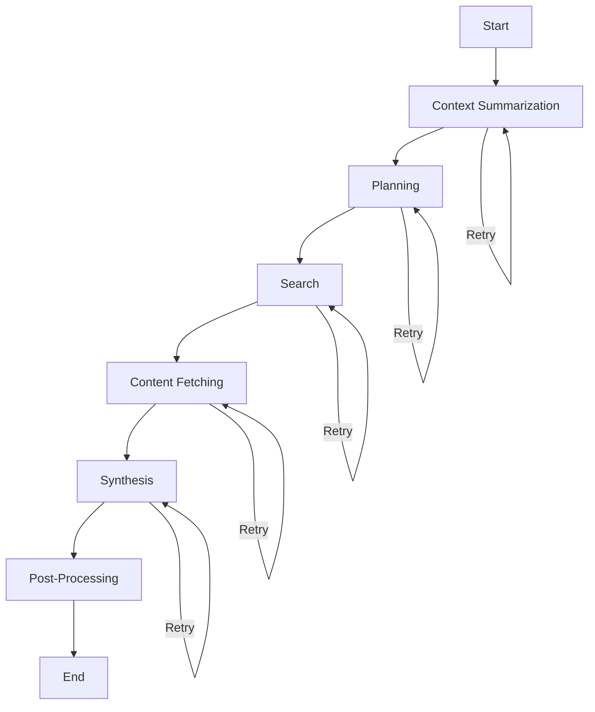

# Research Brief Generator

🔬 **AI-Powered Research Brief Generation using LangGraph and Gemini 1.5 Flash**

A sophisticated research assistant system that generates structured, evidence-linked research briefs in response to user topics. The application supports follow-up queries by summarizing prior user interactions and incorporating this context into subsequent outputs.


## Video Sample for API URL with sample request and response, Click below drive link to view.
https://drive.google.com/file/d/1ct7iF23WVR9J1nlq9y08tI6ZrCi_RlR3/view?usp=drive_link


## Photo Samples
For the latest updates and detailed documentation, visit our [GitHub repository](https://github.com/Jeypraveen/Research-Brief-Generator).


## 🌟 Features

- **🧠 AI-Powered Research**: Uses Google's Gemini 1.5 Flash model for intelligent content generation
- **🔄 LangGraph Orchestration**: Implements a robust workflow with distinct nodes for each processing step
- **📊 Structured Output**: All outputs follow strict schemas using Pydantic validation
- **🔍 Web Search Integration**: Automatically searches and analyzes relevant web content
- **💭 Context Awareness**: Supports follow-up queries with previous interaction context
- **🌐 Multiple Interfaces**: CLI, Web UI (Flask), and REST API (FastAPI)
- **✅ Comprehensive Testing**: Unit tests and CI/CD pipeline integration
- **📈 Observability**: LangSmith tracing support for monitoring executions


## 🏗️ Architecture

The system uses **LangGraph** for workflow orchestration with the following nodes:

1. **Context Summarization**: Analyzes previous user interactions
2. **Planning**: Creates research strategy and search queries
3. **Search**: Executes web searches for relevant information
4. **Content Fetching**: Retrieves and processes source content
5. **Synthesis**: Combines all research into a structured brief
6. **Post-Processing**: Final validation and formatting

### Graph Architecture



## 🚀 Quick Start

### Prerequisites

- Python 3.9+ (Python 3.13.2 recommended)
- Visual Studio Code (optional but recommended)
- Gemini API Key (free tier available)

### 1. Get Your Free Gemini API Key

1. Visit [Google AI Studio](https://ai.google.dev/)
2. Sign in with your Google account
3. Click "Get API Key" → "Create API Key"
4. Copy your API key

### 2. Installation

```bash
# Clone the repository
git clone <your-repo-url>
cd research_brief_generator

# Create virtual environment
python -m venv venv

# Activate virtual environment
# Windows:
venv\Scripts\activate
# Linux/Mac:
source venv/bin/activate

# Install dependencies
pip install -r requirements.txt

# Setup environment
cp .env.example .env
# Edit .env and add your GEMINI_API_KEY
```

### 3. Quick Test

```bash
# Run health check
python main.py --health-check

# Generate your first research brief
python main.py --topic "Artificial Intelligence in Healthcare" --depth 3
```

## 💻 Visual Studio Code Setup

### Installation Steps

1. **Download and Install VS Code**
   - Visit [code.visualstudio.com](https://code.visualstudio.com)
   - Download for Windows/Mac/Linux
   - Run the installer

2. **Install Python Extension**
   ```
   1. Open VS Code
   2. Press Ctrl+Shift+X (or Cmd+Shift+X on Mac)
   3. Search for "Python"
   4. Install the "Python" extension by Microsoft
   ```

3. **Configure Python Interpreter**
   ```
   1. Open the project folder in VS Code
   2. Press Ctrl+Shift+P (or Cmd+Shift+P on Mac)
   3. Type "Python: Select Interpreter"
   4. Choose the Python interpreter from your virtual environment
      (should be ./venv/Scripts/python.exe on Windows or ./venv/bin/python on Linux/Mac)
   ```

4. **Install Recommended Extensions**
   - Python (Microsoft) - Already installed
   - Pylance (Microsoft) - Advanced Python language support
   - Python Debugger (Microsoft) - Debugging support
   - GitLens (GitKraken) - Enhanced Git capabilities
   - REST Client (Huachao Mao) - For testing APIs

### VS Code Configuration

Create `.vscode/settings.json` in your project:

```json
{
    "python.defaultInterpreter": "./venv/Scripts/python.exe",
    "python.linting.enabled": true,
    "python.linting.flake8Enabled": true,
    "python.formatting.provider": "black",
    "python.formatting.blackArgs": ["--line-length=100"],
    "files.exclude": {
        "**/__pycache__": true,
        "**/.pytest_cache": true
    }
}
```

### Running in VS Code

1. **Terminal**: Press `Ctrl+`` to open integrated terminal
2. **Run Script**: Press `F5` to run with debugger
3. **Debug**: Set breakpoints and use the debugging panel

## 🎯 Usage

### Command Line Interface

```bash
# Basic usage
python main.py --topic "Your research topic" --depth 3

# Advanced usage
python main.py \
  --topic "Climate Change Impact on Agriculture" \
  --depth 4 \
  --follow-up \
  --user-id "researcher_123" \
  --output research_brief.json \
  --format markdown \
  --verbose

# Start web application
python main.py --web-app --port 5000

# Start API server  
python main.py --api --port 8000
```

### Web Interface

1. Start the web application:
   ```bash
   python main.py --web-app
   ```

2. Open your browser to `http://localhost:5000`

3. Enter your research topic and configure settings

4. Click "Generate Research Brief" and watch the progress

### REST API

Start the API server:
```bash
python main.py --api
```

Example API request:
```bash
curl -X POST "http://localhost:8000/brief" \
  -H "Content-Type: application/json" \
  -d '{
    "topic": "Renewable Energy Trends",
    "depth": 3,
    "follow_up": false,
    "user_id": "api_user"
  }'
```

API Documentation available at: `http://localhost:8000/docs`

## 📋 API Reference

### POST /brief

Generate a research brief.

**Request Body:**
```json
{
  "topic": "string (5-500 chars)",
  "depth": "integer (1-5)",
  "follow_up": "boolean",
  "user_id": "string (1-100 chars)"
}
```

**Response:**
```json
{
  "success": true,
  "brief": {
    "topic": "string",
    "executive_summary": "string",
    "key_findings": ["string"],
    "detailed_analysis": "string", 
    "recommendations": ["string"],
    "sources": [
      {
        "url": "string",
        "title": "string", 
        "summary": "string",
        "relevance_score": 0.8,
        "key_points": ["string"]
      }
    ],
    "confidence_score": 0.85,
    "generated_at": "2024-01-01T12:00:00Z"
  },
  "processing_time": 45.2
}
```

## 🔧 Configuration

### Environment Variables

Copy `.env.example` to `.env` and configure:

```bash
# Required
GEMINI_API_KEY=your_gemini_api_key_here

# Optional
GEMINI_MODEL=gemini-1.5-flash
TEMPERATURE=0.7
MAX_RETRIES=3
FLASK_PORT=5000
FASTAPI_PORT=8000
```

### Model Selection

- **gemini-1.5-flash**: Fast, cost-efficient (recommended)
- **gemini-1.5-pro**: More capable, slower
- **gemini-2.0-flash**: Latest model (if available)

### Research Depth Levels

1. **Level 1**: Basic overview (1-2 sources)
2. **Level 2**: Light research (3-4 sources)  
3. **Level 3**: Standard research (5-7 sources) ⭐ *Recommended*
4. **Level 4**: Deep research (8-10 sources)
5. **Level 5**: Comprehensive analysis (10+ sources)

## 🧪 Testing

Run the complete test suite:

```bash
# Run all tests
make test

# Run specific tests
python -m pytest tests/test_workflow.py -v

# Run with coverage
python -m pytest tests/ --cov=src --cov-report=html
```

### Test Structure

- `tests/test_workflow.py`: End-to-end workflow tests
- `tests/test_nodes.py`: Individual node unit tests

## 🚀 Deployment

### Local Development

```bash
# Using Makefile
make setup
make run-web

# Manual setup
python -m venv venv
source venv/bin/activate  # or venv\Scripts\activate on Windows
pip install -r requirements.txt
python main.py --web-app
```

### Production Deployment

#### Docker Deployment

```bash
# Build image
docker build -t research-brief-generator .

# Run container
docker run -p 8000:8000 --env-file .env research-brief-generator
```

#### Heroku Deployment

```bash
# Add Procfile
echo "web: python main.py --api --host 0.0.0.0 --port \$PORT" > Procfile

# Deploy
git add .
git commit -m "Deploy to Heroku"
git push heroku main

# Set environment variables
heroku config:set GEMINI_API_KEY=your_api_key_here
```

#### Cloud Platform Deployment

The application is cloud-ready and can be deployed to:
- **AWS**: EC2, Lambda, or Elastic Beanstalk
- **Google Cloud**: Cloud Run, App Engine, or Compute Engine
- **Azure**: Container Instances or App Service

## 📊 Structured Output Schemas

### Research Plan Schema
```python
class ResearchPlan(BaseModel):
    topic: str
    research_questions: List[str]
    search_queries: List[str] 
    expected_sources: List[str]
    depth_level: int
```

### Source Summary Schema
```python
class SourceSummary(BaseModel):
    url: str
    title: str
    summary: str
    relevance_score: float
    key_points: List[str]
```

### Final Brief Schema
```python
class FinalBrief(BaseModel):
    topic: str
    executive_summary: str
    key_findings: List[str]
    detailed_analysis: str
    recommendations: List[str]
    sources: List[SourceSummary]
    research_steps: List[ResearchStep]
    limitations: List[str]
    confidence_score: float
    generated_at: str
```

## 🔍 Observability and Monitoring

### LangSmith Integration

Enable tracing by setting environment variables:

```bash
LANGSMITH_API_KEY=your_langsmith_key
LANGSMITH_TRACING=true
LANGSMITH_PROJECT=research-brief-generator
```

### Performance Metrics

- **Token Usage**: Tracked per execution
- **Latency**: Node-level and total execution time
- **Success Rate**: Workflow completion statistics
- **Error Tracking**: Detailed error logs and retry counts

## 🐛 Troubleshooting

### Common Issues

1. **API Key Error**
   ```bash
   ❌ No API key found. Please set GEMINI_API_KEY environment variable.
   ```
   **Solution**: Set your Gemini API key in `.env` file

2. **Import Errors** 
   ```bash
   ❌ ModuleNotFoundError: No module named 'langgraph'
   ```
   **Solution**: Install dependencies with `pip install -r requirements.txt`

3. **Port Already in Use**
   ```bash
   ❌ OSError: [Errno 98] Address already in use
   ```
   **Solution**: Use a different port with `--port 5001`

### Debug Mode

Enable verbose logging:
```bash
python main.py --topic "Your topic" --verbose --debug
```

## 📈 Cost and Latency Benchmarks

### Gemini 1.5 Flash (Free Tier)

- **Rate Limits**: 15 requests per minute, 1 million tokens per day
- **Average Latency**: 2-5 seconds per node
- **Total Processing Time**: 15-60 seconds (depending on depth)
- **Token Usage**: 
  - Depth 1: ~2,000 tokens
  - Depth 3: ~8,000 tokens 
  - Depth 5: ~15,000 tokens

### Performance Optimization

- Use **depth level 3** for optimal speed/quality balance
- Enable **streaming** for real-time progress updates
- Implement **caching** for repeated queries
- Use **checkpointing** for long-running workflows

## 🔒 Limitations and Areas for Improvement

### Current Limitations

1. **Search Integration**: Currently uses simulated search results for demonstration
2. **Language Support**: Optimized for English content
3. **Source Verification**: Limited fact-checking capabilities
4. **Scale**: Single-user focused, not designed for high-volume concurrent usage

### Areas for Improvement

1. **Real Search APIs**: Integrate Tavily, SerpAPI, or Google Custom Search
2. **Multi-language**: Support for non-English research topics
3. **Advanced Filtering**: Source credibility scoring and filtering
4. **Collaborative Features**: Multi-user workspaces and sharing
5. **Export Options**: PDF generation and formatted reports

## 🤝 Contributing

1. Fork the repository
2. Create a feature branch (`git checkout -b feature/amazing-feature`)
3. Commit your changes (`git commit -m 'Add amazing feature'`)
4. Push to the branch (`git push origin feature/amazing-feature`)
5. Open a Pull Request

### Development Setup

```bash
# Install development dependencies
make dev-install

# Run linting and formatting
make lint
make format

# Run all checks
make check
```

## 📄 License

This project is licensed under the MIT License - see the [LICENSE](LICENSE) file for details.

## 🙏 Acknowledgments

- **LangChain Team** for the excellent LangGraph framework
- **Google AI** for providing free-tier access to Gemini models
- **Pydantic Team** for robust data validation
- **Flask and FastAPI** communities for excellent web frameworks

## 📞 Support

- **Documentation**: Check this README and inline code comments
- **Issues**: Open a GitHub issue for bugs or feature requests
- **Discussions**: Use GitHub Discussions for questions and ideas

## 🔗 Related Projects

- [LangGraph Documentation](https://langchain-ai.github.io/langgraph/)
- [LangChain Google GenAI](https://python.langchain.com/docs/integrations/chat/google_generative_ai)
- [Gemini API Documentation](https://ai.google.dev/docs)
- [Pydantic Documentation](https://pydantic.dev/)

---

**Built with ❤️ using LangGraph, Gemini 1.5 Flash, and Python**


